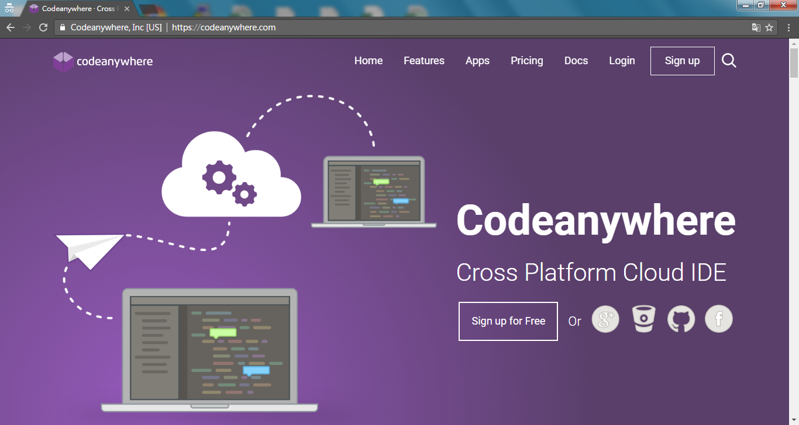
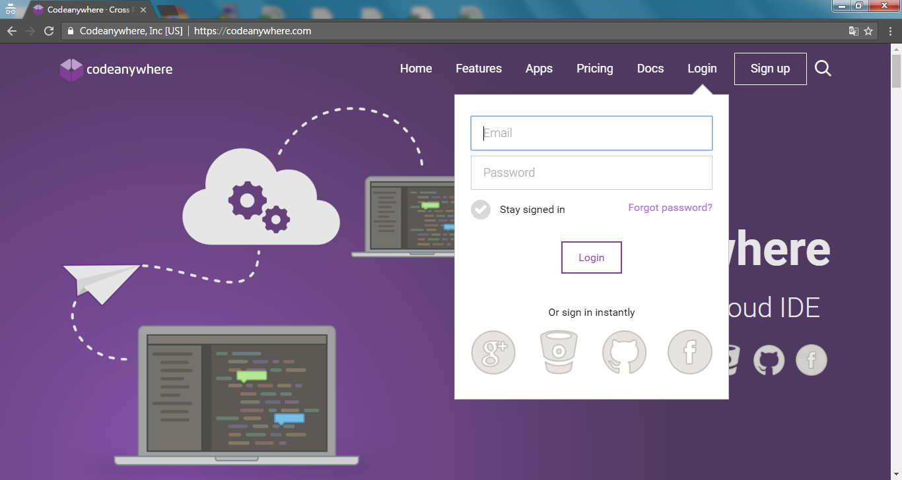
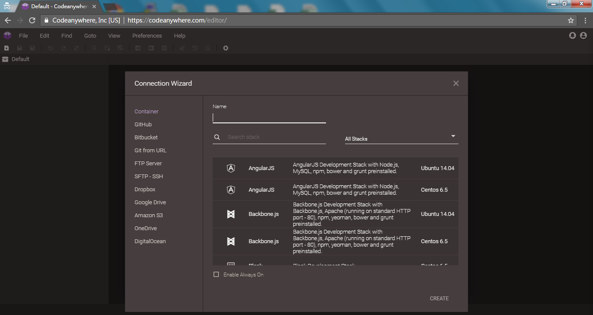
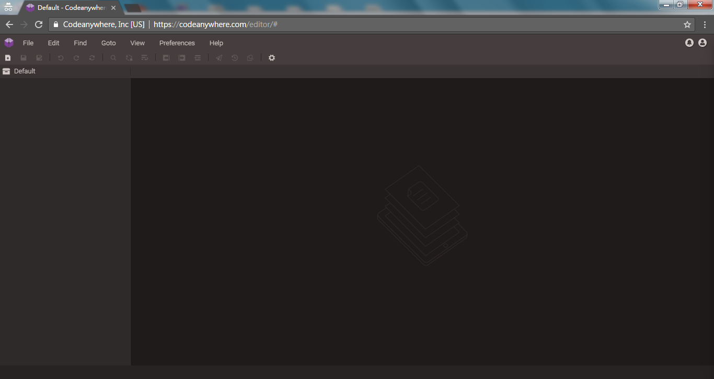
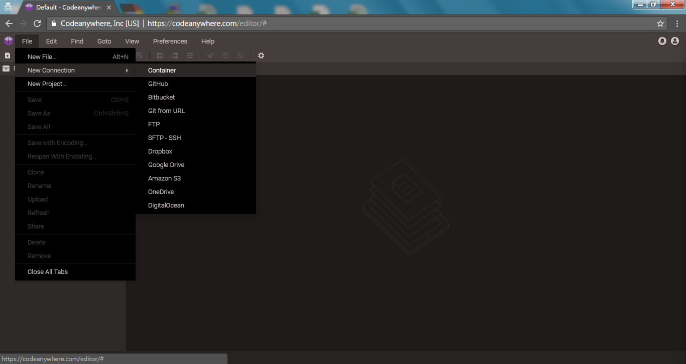
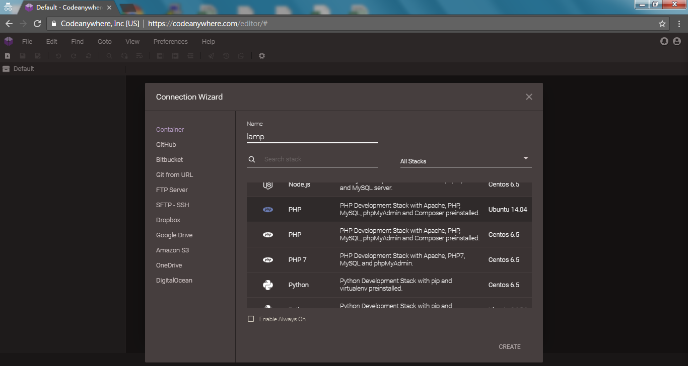
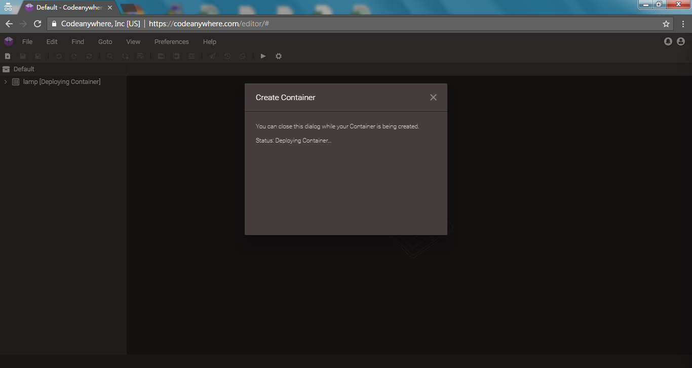
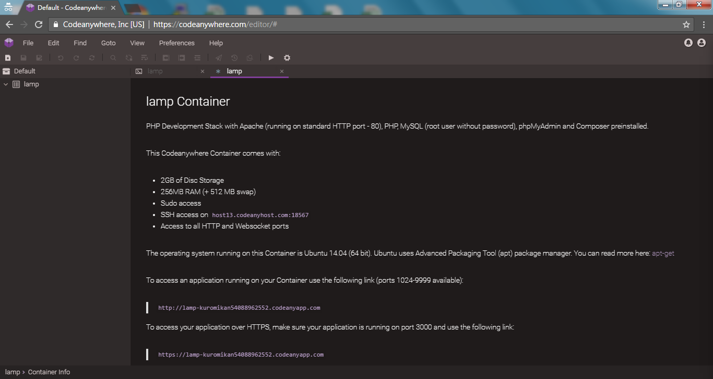

codeanywhere建立專案

點擊Login開啟登入選項
***

輸入Email,Password後點擊Login登入
***

第一次進入後會顯示新增連線，如關閉後要在新增參考下方
***

點選File
***

滑鼠移到New Connection後點擊Container
***

Name填入此虛擬機名稱，中間選項可選擇要預先安裝的語言及OS
***

建立成功之畫面
***

系統基本訊息
***