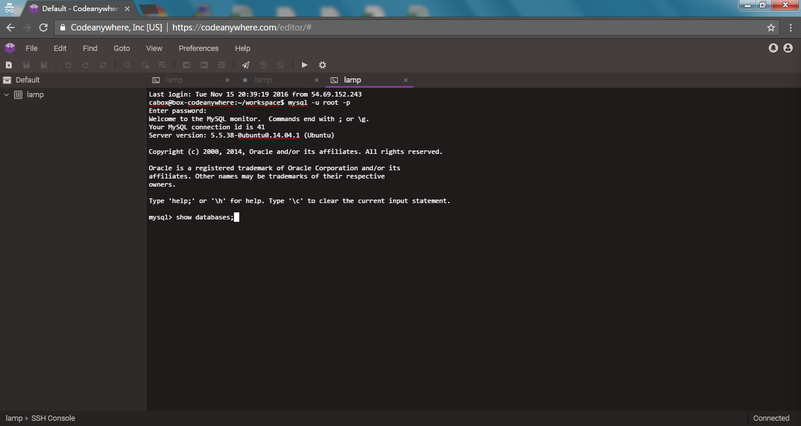
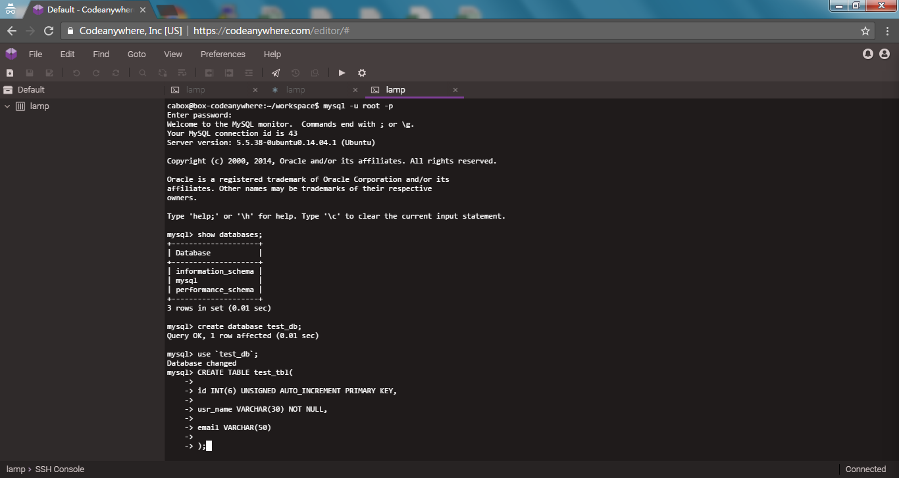
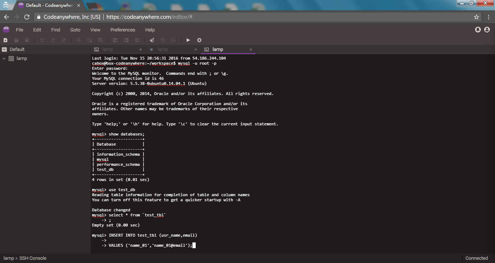
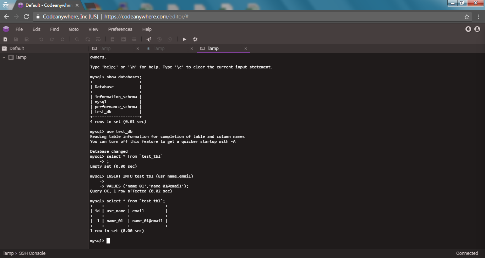

codeanywhere資料庫使用

滑鼠對建立好的連線點擊右建，選擇SSH Terminal
***

在文字框內輸入

`mysql -u root -p`

登入
***

詢問密碼，預設為空直接Enter
***

更改密碼

`SET PASSWORD FOR 'root'@'localhost' = PASSWORD('password');`

***

查詢成功
***

更新相關權限

`flush privileges;`

***

查詢成功
***

顯示現有資料庫

`show databases;`

***

查詢成功畫面
***

建立新資料庫

`create database test_db;`

***

選擇資料庫

``use `test_db`;``

***

建立資料表

`CREATE TABLE test_tbl(`

`id INT(6) UNSIGNED AUTO_INCREMENT PRIMARY KEY,`

`usr_name VARCHAR(30) NOT NULL,`

`email VARCHAR(50)`

`);`

***

查詢資料表

``select * from `test_tbl`;``

***

查詢成功
***

輸入資料內容

`INSERT INTO test_tbl (usr_name,email)`

`VALUES ('name_01','name_01@email');`

***

查詢資料表

``select * from `test_tbl`;``

***

查詢成功之畫面
***
